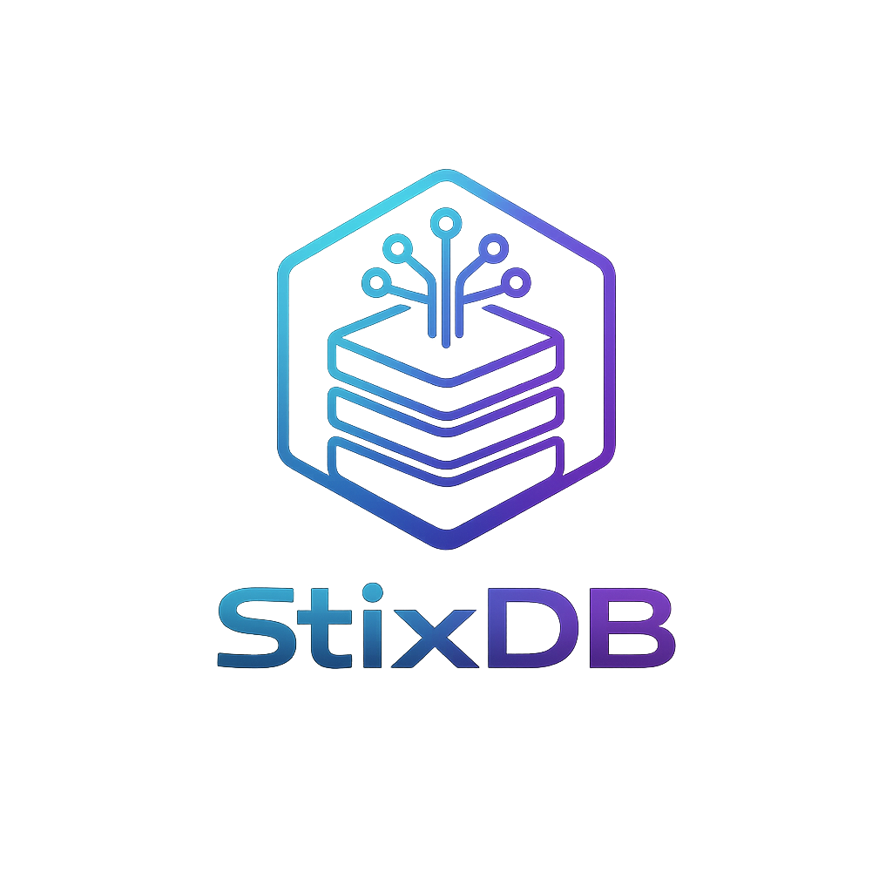
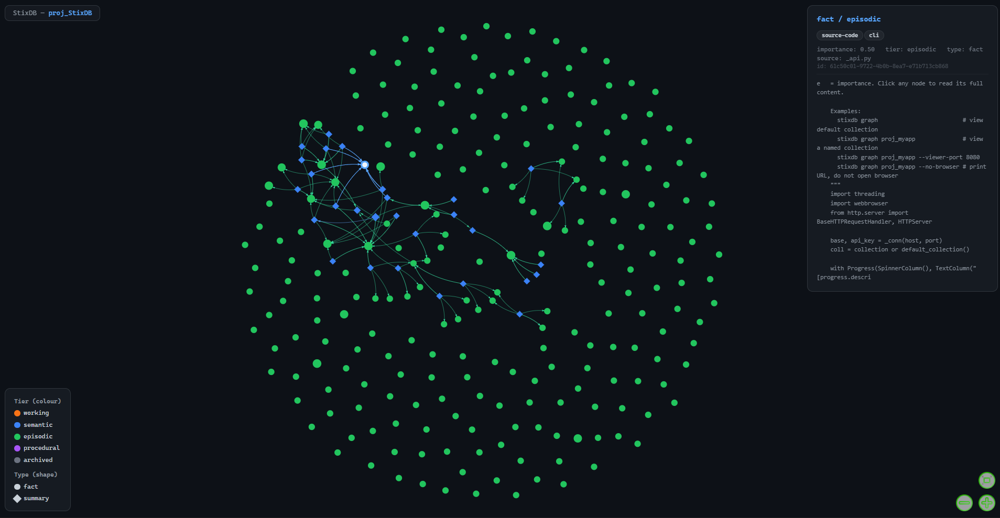

<p align="center">
  
</p>

<p align="center">
  
  
  <a href="https://pypi.org/project/stixdb-engine/"></a>
  <a href="https://pypi.org/project/stixdb-sdk/"></a>
  
</p>

<h1 align="center">StixDB — Living Memory for AI Agents</h1>

<p align="center"><b>A self-organizing memory database for AI agents. Stores facts, cleans up stale data automatically, and answers questions with citations.</b></p>

---

## Install

```bash
pip install "stixdb-engine[local-dev]"
```

---

## Get Started

**1. Configure** (run once — saves to `~/.stixdb/config.json`):
```bash
stixdb init
```

**2. Start the server:**
```bash
stixdb daemon start
```

**3. Ingest something:**
```bash
stixdb ingest ./docs/ -c my_project
```

**4. Ask a question:**
```bash
stixdb ask "What did I learn about the auth system?" -c my_project
```

That's it. StixDB is now running in the background, organizing your memories automatically.

---

## Command Reference

### Setup

| Command | Description |
|---|---|
| `stixdb init` | Configure StixDB globally (`~/.stixdb/config.json`) |
| `stixdb init --local` | Configure per-project (`.stixdb/config.json` in current directory) |
| `stixdb info` | Show the active configuration |
| `stixdb status` | Ping the running server |

```bash
stixdb init               # walk through the setup wizard
stixdb info               # show LLM, storage, port, and key settings
stixdb status             # check if the server is up
```

---

### Server

Run StixDB as a **foreground process** or a **background daemon**.

#### Foreground
```bash
stixdb serve                        # start on the configured port (default 4020)
stixdb serve --port 4321            # custom port
```

#### Daemon (background)

| Command | Description |
|---|---|
| `stixdb daemon start` | Start the server in the background |
| `stixdb daemon stop` | Stop the background server |
| `stixdb daemon restart` | Restart the background server |
| `stixdb daemon status` | Check if the daemon is running |
| `stixdb daemon logs` | View server logs |

```bash
stixdb daemon start
stixdb daemon status
stixdb daemon logs
stixdb daemon restart
stixdb daemon stop
```

---

### Ingest

Load files or entire directories into a collection.

```bash
stixdb ingest ./docs/                          # ingest a folder
stixdb ingest ./notes.md                       # ingest a single file
stixdb ingest ./src/ -c proj_myapp             # specify a collection
stixdb ingest ./data/ -c proj_myapp --tags source-code,docs
```

**Options:**

| Option | Default | Description |
|---|---|---|
| `-c`, `--collection` | from config | Target collection name |
| `--tags` | — | Comma-separated tags to attach to ingested nodes |
| `--chunk-size` | `600` | Characters per chunk |
| `--chunk-overlap` | `150` | Overlap between consecutive chunks |
| `--importance` | `0.7` | Base importance score (0.0–1.0) |

StixDB respects `.gitignore` and skips `node_modules`, `.git`, and binary files automatically.

---

### Store

Write a single memory node directly.

```bash
stixdb store "Alice is the lead engineer on the payments team." -c my_project
stixdb store "Decided to use KuzuDB for persistent storage." -c my_project --tags decisions --importance 0.9
```

**Options:**

| Option | Default | Description |
|---|---|---|
| `-c`, `--collection` | from config | Target collection |
| `--tags` | — | Comma-separated tags |
| `--importance` | `0.7` | Importance score (0.0–1.0) |
| `--node-type` | `fact` | Node type (`fact`, `summary`, etc.) |

---

### Search

Semantic search — fast, no LLM, returns ranked matches.

```bash
stixdb search "auth middleware"                        # search default collection
stixdb search "database decisions" -c proj_myapp       # search a named collection
stixdb search "in progress" -c proj_myapp --top-k 10
```

**Options:**

| Option | Default | Description |
|---|---|---|
| `-c`, `--collection` | from config | Collection to search |
| `--top-k` | `10` | Number of results to return |
| `--depth` | `1` | Graph expansion depth (higher = more context) |
| `--threshold` | `0.25` | Minimum similarity score (0.0–1.0) |

---

### Ask

Ask a natural-language question. The agent retrieves relevant memory, reasons over it, and returns a cited answer.

```bash
stixdb ask "What was I working on last session?"
stixdb ask "What decisions have been made about storage?" -c proj_myapp
stixdb ask "Summarize all known bugs" -c proj_myapp --top-k 20 --depth 3
```

**Options:**

| Option | Default | Description |
|---|---|---|
| `-c`, `--collection` | from config | Collection to query |
| `--top-k` | `15` | Nodes to retrieve before reasoning |
| `--depth` | `2` | Graph traversal depth |
| `--threshold` | `0.25` | Minimum similarity score |
| `--thinking` | `1` | Reasoning steps (`1` = single-pass, `2+` = multi-hop) |
| `--hops` | `4` | Retrieval hops per thinking step |

**When to use `ask` vs `search`:**
- Use `search` when you want specific facts back quickly (no LLM cost).
- Use `ask` when you need the answer synthesised across multiple memories.

---

### Graph Viewer

Open an interactive visual graph of a collection in your browser.

```bash
stixdb graph                                    # view default collection
stixdb graph proj_myapp                         # view a named collection
stixdb graph proj_myapp --viewer-port 8080      # custom local port
stixdb graph proj_myapp --no-browser            # print URL only
```

<p align="center">
  
</p>

The viewer starts a local server (default port `4021`) and opens your browser. Node colour = memory tier. Node size = importance. Click any node to read its full content.

**Options:**

| Option | Default | Description |
|---|---|---|
| `--viewer-port`, `-p` | `4021` | Local port for the graph viewer |
| `--no-browser` | `false` | Print URL without opening the browser |

---

### Collections

Manage your collections.

```bash
stixdb collections list                         # list all collections
stixdb collections stats  my_project            # node/edge counts and tier breakdown
stixdb collections dedupe my_project            # remove duplicate chunks
stixdb collections dedupe my_project --dry-run  # preview duplicates without deleting
stixdb collections delete my_project            # delete a collection (irreversible)
stixdb collections delete my_project --yes      # skip confirmation prompt
```

---

## Configuration

StixDB is configured once with `stixdb init`. Settings are stored in `~/.stixdb/config.json` and read on every command.

To override settings for a single project, run `stixdb init --local` inside that directory. Local config takes priority over global.

### Environment Variables

You can also configure StixDB via environment variables or a `.env` file:

```bash
# LLM
STIXDB_LLM_PROVIDER=openai            # openai | anthropic | ollama | none
OPENAI_API_KEY=sk-...
ANTHROPIC_API_KEY=sk-ant-...

# Storage
STIXDB_STORAGE_MODE=kuzu              # memory | kuzu | neo4j
STIXDB_KUZU_PATH=./my_db

# Server
STIXDB_API_PORT=4020
STIXDB_API_KEY=your-secret-key        # optional — enables auth on the REST API

# Background agent
STIXDB_AGENT_CYCLE_INTERVAL=30.0      # seconds between background cycles
STIXDB_AGENT_CONSOLIDATION_THRESHOLD=0.88
STIXDB_AGENT_DECAY_HALF_LIFE=48.0     # hours
STIXDB_AGENT_PRUNE_THRESHOLD=0.05
```

### Storage Backends

| Backend | Persistence | Install | Best For |
|---|---|---|---|
| **In-Memory** | Lost on restart | Included | Testing, prototypes |
| **KuzuDB** | On-disk | `pip install "stixdb-engine[local-dev]"` | Local dev, laptops |
| **Neo4j + Qdrant** | Production | Docker | High scale, multi-agent |

---

## How the Background Agent Works

Every 30 seconds (configurable), StixDB runs a background cycle on each collection:

1. **Merge** — nodes above `0.88` cosine similarity are merged into a summary node. Originals are archived, not deleted.
2. **Deduplicate** — exact content duplicates are collapsed (highest importance wins).
3. **Decay** — archived nodes decay with a 48-hour half-life. Nodes below `0.05` importance are pruned.

The cycle processes a capped batch of 64 nodes — CPU cost stays flat regardless of collection size.

---

---

## For Developers

### REST API

The StixDB server exposes a REST API on `http://localhost:4020` (default).

#### Health

```
GET /health
```
```json
{ "status": "ok", "collections": ["proj_myapp", "proj_other"] }
```

---

#### Store a node

```
POST /collections/{collection}/nodes
```
```json
{
  "content": "Alice leads the payments team.",
  "node_type": "fact",
  "importance": 0.8,
  "tags": ["team", "payments"]
}
```
```json
{ "node_id": "abc123", "collection": "proj_myapp", "status": "stored" }
```

---

#### Semantic search

```
POST /search
```
```json
{
  "query": "who leads payments",
  "collection": "proj_myapp",
  "top_k": 10,
  "threshold": 0.25,
  "depth": 1
}
```

---

#### Ask (LLM reasoning)

```
POST /collections/{collection}/ask
```
```json
{
  "question": "What decisions were made about auth?",
  "top_k": 20,
  "depth": 2,
  "thinking_steps": 1,
  "hops_per_step": 4,
  "max_tokens": 1024
}
```
```json
{
  "answer": "The team decided to use bcrypt...",
  "sources": [...],
  "confidence": 0.91
}
```

---

#### Ingest a file

```
POST /collections/{collection}/ingest
```
```json
{
  "path": "/absolute/path/to/file.md",
  "tags": ["docs"],
  "chunk_size": 600,
  "chunk_overlap": 150
}
```

---

#### Graph data

```
GET /collections/{collection}/graph
```

Returns all nodes and edges for use in custom visualisations.

---

#### Collection stats

```
GET /collections/{collection}/stats
```
```json
{
  "total_nodes": 312,
  "total_edges": 87,
  "nodes_by_tier": { "semantic": 120, "episodic": 192 }
}
```

---

#### Authentication

If `STIXDB_API_KEY` is set, include it on every request:

```bash
curl -H "X-API-Key: your-secret-key" http://localhost:4020/health
```

---

### Python SDK

```bash
pip install stixdb-sdk
```

```python
from stixdb_sdk import StixDBClient

with StixDBClient("http://localhost:4020", api_key="optional") as client:
    # Store
    client.memory.store("my_project", content="Alice leads payments.")

    # Ingest
    client.memory.ingest_folder("my_project", folder_path="./docs")

    # Search
    results = client.query.search("my_project", query="payments lead", top_k=5)

    # Ask
    answer = client.query.ask("my_project", question="Who leads payments?")
    print(answer.answer)
```

---

### Python Engine (embedded, no server)

Use the engine directly inside your own application — no server process needed.

```python
import asyncio
from stixdb import StixDBEngine, StixDBConfig
from stixdb.config import StorageConfig, StorageMode, ReasonerConfig, LLMProvider

async def main():
    config = StixDBConfig(
        storage=StorageConfig(mode=StorageMode.KUZU, kuzu_path="./my_db"),
        reasoner=ReasonerConfig(provider=LLMProvider.OPENAI, model="gpt-4o"),
    )
    async with StixDBEngine(config=config) as engine:
        await engine.store("my_agent", "Alice is lead engineer on payments.")

        # Semantic retrieval (no LLM)
        results = await engine.retrieve("my_agent", "payments lead", top_k=5)

        # LLM-synthesised answer
        response = await engine.ask("my_agent", "Who leads the payments team?")
        print(response.answer)
        print(response.confidence)

asyncio.run(main())
```

**Config from environment:**
```python
config = StixDBConfig.from_env()
```

---

### OpenAI-Compatible Endpoint

StixDB exposes an OpenAI-compatible `/v1/chat/completions` endpoint so any OpenAI client can query your memory graph directly:

```python
from openai import OpenAI

client = OpenAI(base_url="http://localhost:4020/v1", api_key="your-stixdb-key")
response = client.chat.completions.create(
    model="stixdb",
    messages=[{"role": "user", "content": "What do you know about the payments team?"}],
)
print(response.choices[0].message.content)
```

---

## License

MIT — see [LICENSE](LICENSE).

<p align="center">
  <i>AI agents deserve better than flat files. Give yours a living memory.</i>
</p>
