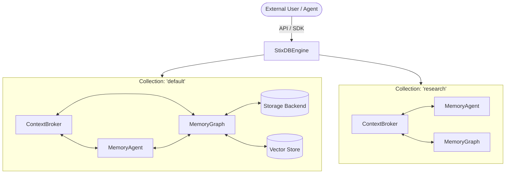
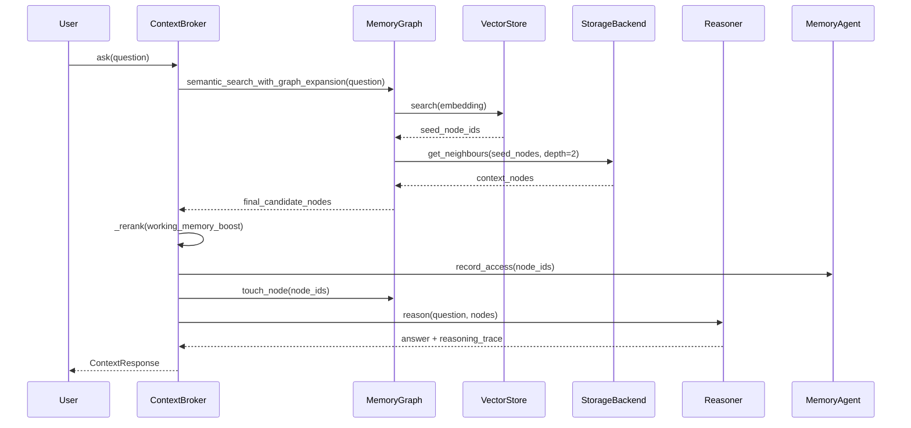
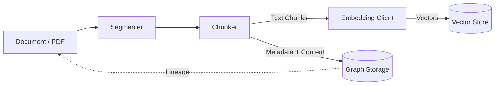
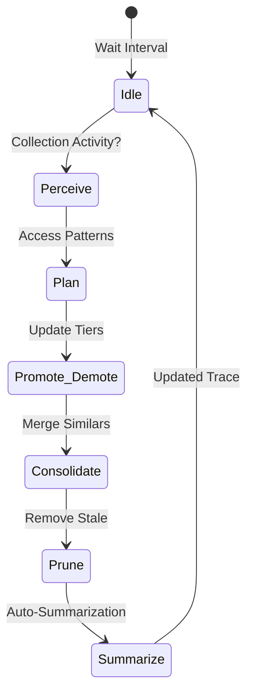

# StixDB Architecture Diagrams

This document provides visual representations of the core StixDB workflows.

## 1. System Overview

The `StixDBEngine` manages multiple `Collections`. Each collection is an isolated unit with its own graph, agent, and context broker.

## 2. Query Flow (`ask`)

When a user asks a question, StixDB performs a multi-phase retrieval before synthesizing an answer.

## 3. Ingestion Flow

Files and folders are chunked, embedded, and stored as graph nodes.

## 4. Autonomous Maintenance Cycle

The `MemoryAgent` runs a continuous background loop to optimize the graph.

